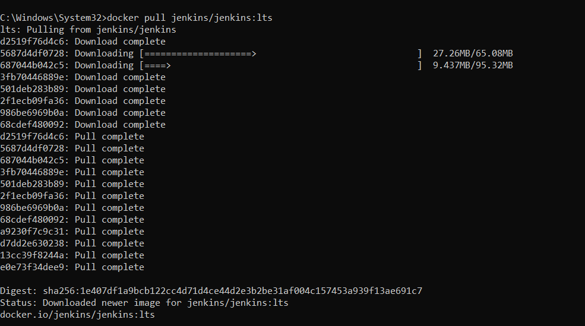
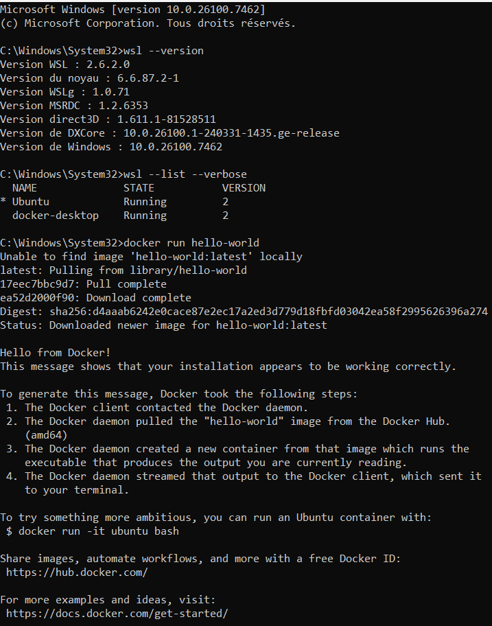
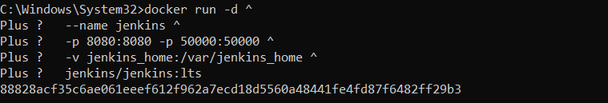
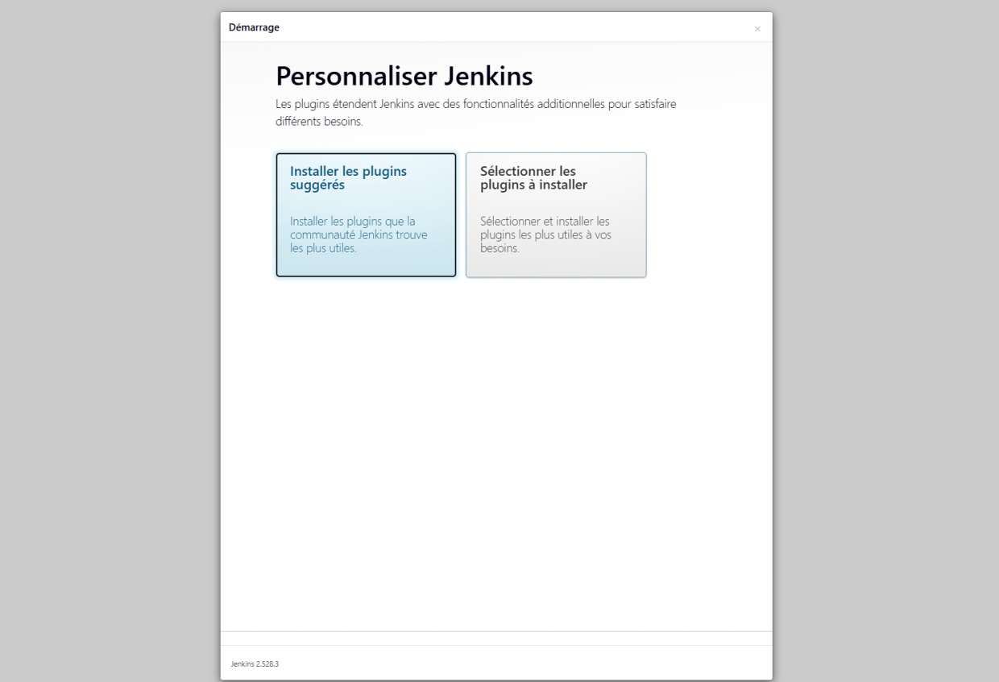
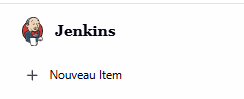
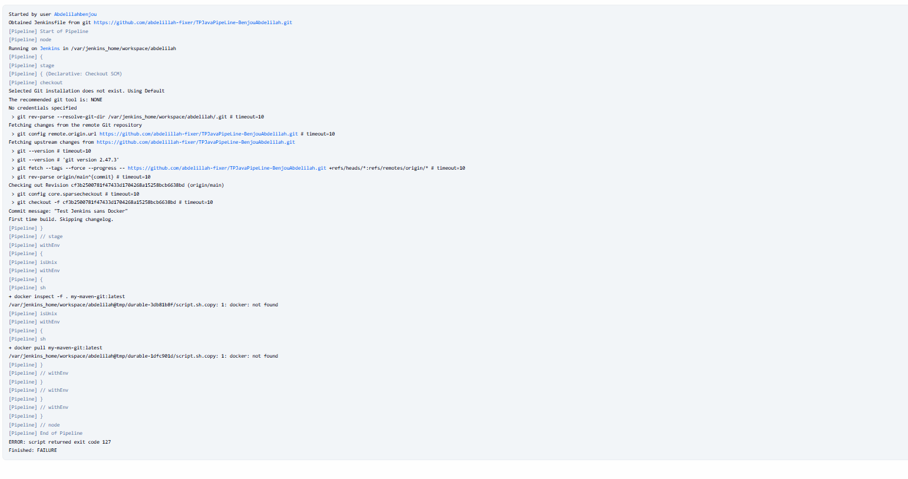
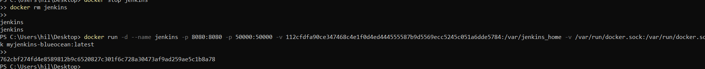

# TP Java Pipeline - Benjou Abdelilah

##  Objectif
Mettre en place Jenkins avec Docker et Blue Ocean, configurer un volume persistant pour conserver les données, et exécuter une pipeline Java Maven.

---

##  Étapes réalisées

1. **Création du volume persistant**
   - Volume `jenkins_home` créé automatiquement par Docker.
   - Vérification avec :
     ```bash
     docker volume inspect jenkins_home
     ```
   - Résultat : le volume est bien monté sur `/var/lib/docker/volumes/jenkins_home/_data`.

2. **Arrêt du conteneur Jenkins existant**
   - Commande :
     ```bash
     docker stop jenkins
     ```
   - Le conteneur est arrêté proprement sans supprimer les données.

3. **Relance de Jenkins avec Blue Ocean et accès au socket Docker**
   - Commande utilisée :
     ```bash
     docker run -d \
       --name jenkins \
       -p 8080:8080 -p 50000:50000 \
       -v jenkins_home:/var/jenkins_home \
       -v /var/run/docker.sock:/var/run/docker.sock \
       jenkinsci/blueocean:latest
     ```
   - L’image officielle `jenkinsci/blueocean:latest` a été téléchargée et utilisée.

---

##  Erreurs rencontrées et solutions

- **Erreur 1 : Image introuvable**
- Cause : l’image `myjenkins-blueocean` n’existait pas sur Docker Hub.
- Solution : utilisation de l’image officielle `jenkinsci/blueocean:latest`.

- **Erreur 2 : Conflit de nom de conteneur**
- Cause : un conteneur nommé `jenkins` existait déjà.
-  Solution : suppression de l’ancien conteneur avec :
  ```bash
  docker rm jenkins
  ```
  puis relance avec la même commande.

---

##  Résultats obtenus
- Jenkins Blue Ocean est opérationnel sur `http://localhost:8080`.
- Le volume `jenkins_home` assure la persistance des jobs et des plugins.
- Les erreurs liées aux images et aux conflits de conteneurs ont été résolues.
- La configuration est prête pour exécuter des pipelines Java Maven.

---


##  Conclusion
Ce TP a permis de :
- Installer et configurer Jenkins avec Docker et Blue Ocean.

- Préparer un environnement prêt pour l’intégration continue avec Jenkins.
 installatio jenkins : 
 
 verifiation wsl docker 
 jenkins ur   navigateur 
 recupére logs 
 installer plugins:
 eter connecter sur jenkins 
ajouter une pipeline 
erreur 2 : 
build my jenkins blueocean 
